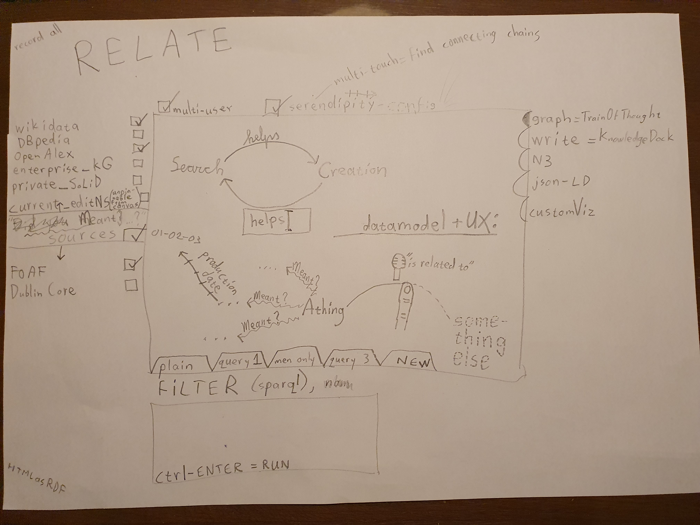

# swipaLOD

Currently, many people (with their associative brains) use whiteboards to draw nodes&arrows both with optional short texts or just one word. Often afterwards a photo is taken of this draft, to later spend quite some time manually turning these pixels into a piece of paper simulated on a computer screen. Usually a Microsoft Word document with an image made with Microsoft Visio or some mindmap tool. This is then often mailed out for the next meeting where many not seldomly realize that they actually misunderstood each other in the previous meeting. And all this time there's no (meta)data available useful for the organisation to find the work, let alone easily use or reason over. And if someone wants a different view on the same data, usually more manual work with the accompanied risk of errors is added

I SUGGEST:
- A REDESIGN FOR THE ABOVE
The whiteboard will be turned horizontal and made a touchscreen for people to stand around and interact with, while also non-digitally talking and gesturing to each other. Plus when the screen is touched it listens to what is said, and when movement of the touch starts or stops, the audio will be divided in text before/along/after the arrow defined during moving. For every text the system gives a list of "Did you mean ... ?" options from previously selected (public and private) data sources and controlled vocabulaires, but also a 'define new here' option. The resulting graph is not only pixels, but Linked Data itself (half) 'under the hood'.
Extra's are multi-user, multi-device, SPARQL-filtering, routefinding, serendipity AI-assistent and capturing the process; the thoughts that got you to the end result.

BECAUSE
- There's loads of double work, delay and room for misunderstanding and errors in the current way, plus the data is in a shape not optimal for algorithms to combine and help the user
- It's a strong combination of search&create in one. But not in a black-box way fundamentally based on using statistics to guess the next word, where synonyms are one of the reasons for chatGPT and the like to produce unlogical texts.
- Much of the interaction with our data and devices is still based on habits built while using technology from an earlier generation, which can't always be optimal
- I think you can get a sense of the power of Linked Data, actually combine data sources in that way, without scaring the average person away with long URLs or computer coding. But of course the dogma of the (paper) document is strong, and 'publish or perish' static PDFs is not limited to scholarly publication
- Lots of AI can be orders of magnitude more energy efficient, plus more accurate, when it includes having a knowledge graph to reason over
- There's more and more FAIR research (meta)data (mostly implemented with Linked Data techniques) available;
- SoLiD (Social Linked Data) personal data pods against too many (possibly outdated) copies of the same data and data hoarding business models (e.g. Facebook) also are growing, for example in microcredentials, private preferences and making sure government organisations have just enough and up-to-date data.
- Traditional relational databases, spreadsheets, enriched (web)documents and applications that take datacentricmanifesto.org into account, can be made available as Linked Data too, through translation layers. Several language techniques including LLMs could assist in the enriching where necessary.

PLUS TEST WHAT (INGREDIENTS) PEOPLE LIKE ABOUT IT AFTER A WHILE OR WHAT MAYBE INSPIRES DIFFERENT IDEAS:

WHAT IS DIFFERENT FROM WHAT PEOPLE MIGHT BE USED TO:
- It actually invites other views and visualisations (e.g. <a href="https://github.com/steltenpower/storyLOD/blob/main/README.md">storyLOD</a> and Zett@Muze), is aimed at being part of an ecosystem by using open fileformats, maybe APIs. It will not even try to be a general Linked Data tool for all situations, by design.
- Usually the involved data will not all simultaneously fit on the screen in a readable way. Though this is quite common for some relatively modern tools, to some it seems to be a strange idea, though don't your PDFs have way too many pages to be simultaneously legibly be rendered on your screen? A magnifying glass or property-based differences in styling could help
- Search results won't always instantly pop up as datasets can be enormous. (un)availability of search results shouldn't decide the workflow of the user. Asynchronous is key.
- Uncommon user interaction will take some time to get used to.
THE ABOVE ALSO HINTS ON CHALLENGES TO LOOK INTO, DO RESEARCH ON

POSSIBLE APPLICATIONS:
- research groups brainstorming what to do next in a few months when multiple projects finish
- Learning Management System in which to match several systems of educational resources and requirements

DIFFERENT APPLICATIONS OF JUST THE SWIPE&TALK INTERACTION:
- Define Process-Channel-Process: for parallel programming with Occam and Go(lang) and very similar draw Component-Connection-Component for electronics
- Define decision trees
- Other graph-shaped subjects.

<i> slowly working towards sloppy mockup in SVGinIframe.html, clumsy video captured in https://github.com/steltenpower/swipaLOD/raw/main/clumsy_video_swipaLOD.mp4 </i>

## Linked data is an established technology, but in case you're not familiar with it: my shortest explanation

Similar to our associative brains, in machines through standardized notation and vocabularies a similar associating is named Linked Data, simplified:
- A statement called a **triple**: _Something A_ has some kind of _relation R_ with _something B_.
- A **graph**: a collection of connected triples.
- Triples pointing from one graph to another graph somewhere else, allow for **querying a combination of graphs**, for which answers can be immediately visualized.
<table><tr><td>Conceptually</td><td>In Linked Data</td></tr><tr><td>
   </td><td>
</td></tr></table>
The fun part of Linked Data is that you can query a combination of graphs, here the blue and the green, as if they were one graph on one system.
You could for example ask (first in a technical language named SPARQL, later possibly taking in natural language processing options that do already exist): "Which persons are interested in stuff by Leonardo da Vinci?".

# below only some useful needles in a big haystack

## Drawing process
- Elements shown from other databases, but not yet refered to from within your namespace, can be tapped to pin them into it.
- Tap again for unpin (this can also mean you unpin what you drew, adding up to 4 combinations: drawn/outside and in/below mindgraph)
- Of course you can only pin what is visible, which usually is only a tiny tiny fraction of data available below the mindgraph.
A possibly complex algorithm and a few user controls (zoom, depth, SPARQLfilter, [RelFinder](http://www.visualdataweb.org/relfinder.php), etc.) to steer it, decide what is visible and how big, detailed or custom, elements are depicted.
- A search algorithm can hang 'Did you Mean?'-type edges from nodes in the mindgraph. If you connect those with a "replaces" pseudo-edge, they'll be combined into one node, meaning **your quick vague mention suddenly became a concept already strictly defined elsewhere**. A sort of opposite is also possible, if you connect with a "ignore suggestions" pseudo-edge, the multiple 'Did you Mean?'-edges will be deleted and the connected nodes will probably drop into the depths.
- Manual added relations get suggestions for relation type available in the current vocabulary search space, which you created by (un)selecting vocabularies. Pick a selection for the relation type, or confirm a new one.

## What more, possibly
- There's so much HTML out there to be used; look into the vocab mentioned in the ["miljoenennota" video on PLDN](https://www.pldn.nl/wiki/De_Miljoenennota_met_Linked_Data_%E2%80%93_10_maart_2022).
- Created data will be shareable to other Linked Data users and projects, including from SoLiD pods.
- Live sharing a.k.a. multi-user mode, might result in several cooperation styles: cleaning/specifying/growing/discussing
- The tool should ideally be almost as fast to operate as your train of thought. Hence, the name. Because of that and needing to fit not only small graphs on screen, interaction should not everywhere need visual indicators taking up space all the time. Content is king, right?
- Offered suggestions will not force you to interact right-there-and-then for several reasons: You should be able to keep the flow in your train of thought. Generating suggestions can take a while and go gradually. Some suggestions could automatically disappear again, because of changes elsewhere (e.g. if I note that someone sucks at sports, to suggest the Wimbledon winner by the same name is no longer logical).
- Maybe it can be nicely combined with [Knowledge Dock](https://github.com/steltenpower/KnowledgeDock).
One allows the user sloppyness in manually drawing a graph, the other allows the user to type a text. In both cases the computer suggests more specific meaning. Maybe they can be synchronized for the current result or maybe even through time by scrolling the story.
- of course all sorts of custom views can be added
- Build it in SVG, possibly with RDFa for search engines.
- A query-builder and result visualizer as known from WikiData gives reasoning power, with almost no coding needed by the user still.
- To not copy nodes or edges, RDF* will be used

- Look into https://www.mindtools.com/amtcc5f/triz too

# FROM HERE ON: EVEN OLDER, LIKELY OUTDATED, EARLY SKETCHES AND STUFF

### (An idea for) a linked mindmapping tool (multi-touch + speech recognition + [Linked(Open)Data](https://en.wikipedia.org/wiki/Linked_data) + keeping-your-flow-UI = quick semantic graph design)

*The idea from a user point of view is at the moment best shown in these photographed drafts:*

Only for more technical (and slightly outdated compared to these photographs) details, keep reading ...

#### PROJECT SETUP:

everything to be identified with URL(s):
1. user, followed by a LOGIN-BUTTON
2. THIS (shared) reasoning canvas to work/cooperate in
3. additional LINKspaces (aka triplestores) available from which concepts and relations can be referred to from within this canvas. One could make entry convenient by a table like:

   |checkbox|name                       |URL                                   |
   |--------|---------------------------|--------------------------------------|
   |      V |DBpedia                    |https://...                           |
   |        |WikiData                   |https://...                           |
   |      V |WorldCat                   |https://...                           |
   |        |my dataPOD                 |https://inrupt...                     |
   |      V |John Doe's dataPOD         |https://...                           |
   |        |name of other thoughtspace |https://...                           |
   |        |uni's personnel reg.       |https://...                           |
   |      V | _ _ _ enter name _ _ _    | _ _ _ enter URL _ _ _                |
   |        | _ _ _ SEARCH _ _ _        | using https://lod-cloud.net/datasets |

4. ontologies available in this canvas. One could make entry convenient by a table like:

   |checkbox|name                     |URL                                           |
   |--------|-------------------------|----------------------------------------------|
   |      V |DC(Dublin Core)          |https://...                                   |
   |        |schema.org               |https://...                                   |
   |      V |FOAF(Friend Of A Friend) |https://...                                   |
   |      V | _ _ _ enter name _ _ _  | _ _ _ enter URL _ _ _                        |
   |        | _ _ _ SEARCH _ _ _      | using https://lov.linkeddata.es/dataset/lov/ |
   

#### PRIMARY INTERACTION:
Train-Of-Thought combines multi-touch with speech recognition (fallback: typing for quick edit) for quickly drawing a semantic graph;
While listening for concepts, matches are searched for in the available LINKspaces, plus general English is used to name new-to-define concepts. Appearing lists of options don't need a choice immediately; just keep drawing (while options load and logic filters them).
Next to what the ontologies define, relation types can also be 'undefined' with "links to". Connecting to a node with a 'relFinder' edge will be interpreted as finding a relation in available LINKspaces with http://www.visualdataweb.org/relfinder.php
Nodes are drawn or selected where the screen is touched.
Relation types are shown along the edge is between.
The following state diagram defines the main user-interaction, for 2 fingers with touch down (1,2) and touch up (~1~,~2~) events:

<pre>
     +------------------+
     | WAITING FOR USER | 
     +------------------+
         ^          \/
 ̶1 > > > ̶1           1
 ^       ^          \/
 ^   +------------------------------------------+
 ^   | if (1 on Node) ==> showingAvailableLINKs |
 ^   |           else ==> ListeningForConceptA  |
 ^   +------------------------------------------+
 ^                 \/
 ^                  2< < < < < < < < < < < < < < < < < < < < < <2
 ^                 \/                                           ^
 ^   +-----------------------------------------------------+    ^
 ^   | if (2 on Edge/Destination) ==> LinkIntoCanvas       |    ^
 ^   |                       else ==> ListeningForRelation |    ^
 ^   +-----------------------------------------------------+    ^
 ^                 \/                                           ^
 ^                  ƻ                                           ^
 ^                 \/                                           ^
 ^   +-------------------------------------------+              ^
 ^   | if (2 on Canvas) ==> ListeningForConceptB |              ^
 ^   +-------------------------------------------+              ^
 ^       \/        \/                                           ^
 ̶1< < < < ̶1         2> > > > > > > > > > > > > > > > > > > > > >2
</pre>
OR, as most screens of any decent size are not multi-touch, better stick to single-touch/mouse
<pre>
ARB=DOWN_ON_CANVAS,SPEAK_A,START_MOVING,SPEAK_R,UP,SPEAK_B,SILENCE
A=DOWN_ON_CANVAS,SPEAK_A,UP
RB=,START_MOVING_ON_A_OR_CANVAS_AS_IMPLIED_A,SPEAK_R,UP,SPEAK_B
SHOW_PROPS_OR_HIDE=CLICK_NODE, SELECT_PROPS=CLICK_PROP
</pre>

#### WRITE QUERIES TO FILTER, CHANGE TABS TO ALTERNATIVE VIEWS:
By adding SPARQL in a textbox, the user can filter the current representation.
I say current as more representations (e.g. N3, JSON-LD) are possible next to default one described in the diagram above (probably implemented in HTML5/SVG with RDFa embedded).

##### THINGS I STILL DOUBT ABOUT A BIT:
- Is there a clear divide between LINKspaces and ontologies?
- Can ontologies be created in the canvas?
- The principle of linked data is nicely shown in https://research.csiro.au/oznome/wp-content/uploads/sites/35/2017/06/image2016-12-6-11-30-49.png , but can I also refer in the canvas to a triple somewhere else, as not copying is the point of this all? Sort of, see http://patterns.dataincubator.org/book/reified-statement.html
OR does it need RDF*'s Lois Lane construct as mentioned in https://douroucouli.wordpress.com/2019/07/11/proposed-strategy-for-semantics-in-rdf-and-property-graphs/ ?
- As syntax of SPARQL queries is very similar to one of the RDF notations, can this tool be used to create SPARQL queries?

OpenAlex.org seems a nice ScienceKnowledgeGraph to use in this.

####Coding hints:

- https://www.ontotext.com/knowledgehub/fundamentals/what-is-rdf-star/

- https://github.com/jquery/PEP
- http://usefulangle.com/post/28/javascript-handling-multi-touch-with-pointer-events
- https://technet.microsoft.com/en-us/windowsserver/hh673557(v=msdn.10).aspx
- https://www.sitepoint.com/unifying-touch-and-mouse-with-pointer-events/
- https://developer.mozilla.org/en-US/docs/Web/API/Pointer_events/Multi-touch_interaction
- https://patrickhlauke.github.io/touch/
- https://docs.microsoft.com/en-us/windows/uwp/design/input/handle-pointer-input
- https://w3c.github.io/pointerevents/
- http://steltenpower.com/pointers.html 
- https://m-ld.org/news/#collaboratenable
- https://steltenpower.github.io/flowchat/

- http://hsc.fed.wiki/assets/home/index.html
- https://www.w3.org/community/htmlvoc/

- On concurring the general graph hairballs

Het is de Expert Network Map: https://pub.fabcloud.io/project/expert-network-map/

De broncode staat hier: https://gitlab.fabcloud.org/pub/project/expert-network-map

The Expert Network Map allows users to visually identify Topic Experts in the Fab community. Topic Experts are Fab Academy students who are frequently referenced by peers. Fab Academy students often link each other's websites in their documentation, and mapping these connections creates a network intertwined across labs, years, and countries. The more times a student is referenced correlates with expertise level in specific subject areas. For current Fab Academy students, it can be extremely helpful to quickly identify Topic Experts to access their documentation for reference.
